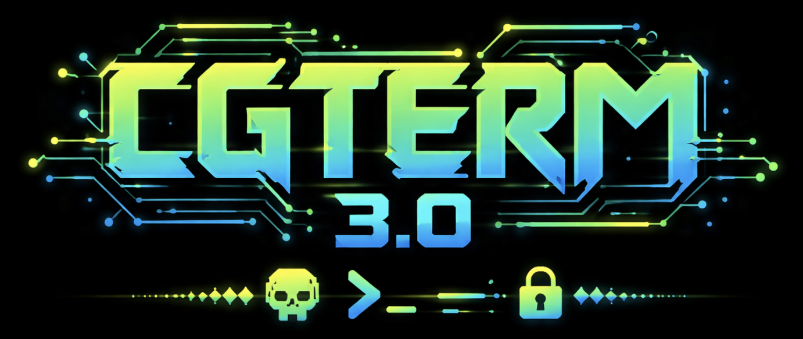

# CGTerm 3.0 :: Scene Edition

Modern port of MagerValp's legendary C64 BBS terminal, released by [Genesis Project](https://csdb.dk/group/?id=8) in 2026. Same soul, modern systems.



[](https://github.com/unbreached/CGTerm-3.0/releases/latest)
[](LICENSE)
[](#install)

## About

CGTerm is the C64 BBS terminal originally written by [Per Olofsson (MagerValp)](https://csdb.dk/scener/?id=1497) in 2003. For two decades it has been the go-to client for connecting to elite Commodore 64 BBSes.

CGTerm 3.0 is a major overhaul: the codebase is cleaned, the foundation is lifted to modern SDL, and the client is extended with the features sysops, swappers and elites have been asking for. PETSCII on glass. Files in motion. Real boards.

## Features

**File transfers and disk images**
- Punter (single + Multi Punter batch)
- XMODEM, XMODEM-CRC, XMODEM-1K
- Rainbow protocol
- Read and write D64 / D71 / D81 disk images directly
- PETSCII-correct filename conversion (`.prg` <-> `,p`, `.seq` <-> `,s`, `.usr` <-> `,u`)
- Transfer progress UI with live hex feed and cancel

**Terminal**
- PETSCII and ANSI (80 col) with runtime toggle
- Telnet IAC filtering for clean chat display
- Raw byte mode for transfer protocols (no IAC interference)
- Clipboard paste paced to baud (no BBS flood)
- Macro record and playback
- Keyboard profiles: US, SE, DE
- SEQ file posting with live PETSCII preview at 300 / 1200 / 2400 / 4800 / 9600 bps

**Scene polish**
- Demo-style splash: vectorballs, plasma, fire, rotozoom, wireframe morph
- Sine wave scroller with scene greetz
- XM/MOD tracker music via libopenmpt
- Modem theatre: fake AT dial sequence + V.34-ish carrier audio
- CRT power-off effect on quit
- 15 header and menu fonts, custom font converter (`tools/make_font.py`)

**Networking and UX**
- Non-blocking connect (UI stays responsive during connection)
- ESC to cancel connection attempts, auto-reconnect
- 40-slot bookmark manager with notes per bookmark
- Overlay menu with categorized sections and timed dismiss

## Platforms

| Platform | Status |
|----------|--------|
| macOS (arm64 + x86_64) | Native .app bundle |
| Linux | `make install`, .deb-friendly paths |
| Windows | Portable zip (unzip and run) |

Cross-compilation from macOS to Windows via MinGW.

## Install

Grab the latest build from [Releases](https://github.com/unbreached/CGTerm-3.0/releases/latest).

### macOS

Open the `.app` bundle. First launch may require right-click → Open (unsigned build).

### Linux

```bash
sudo apt install libsdl1.2-dev libsdl-mixer1.2-dev libopenmpt-dev
make && sudo make install
```

### Windows

Unzip the portable archive and run `cgterm.exe`.

## Build from source

Requirements: SDL 1.2 (sdl12-compat is fine), libopenmpt, GCC or Clang, GNU make.

```bash
git clone https://github.com/unbreached/CGTerm-3.0.git
cd CGTerm-3.0
make
```

Full guide in [INSTALL](INSTALL). Changelog in [CHANGELOG.md](CHANGELOG.md). Rainbow protocol notes in [docs/RAINBOW.txt](docs/RAINBOW.txt).

## Boards to try

```
Frozen Floppy BBS   telnet://bbs.retrohack.se:64128
```

## Credits

```
scene code........ m00p
music............. Mr.Death
support........... mermaid
ideas............. Larry
tested by......... hedning
original code..... MagerValp
```

Full greetz list in the classic [README](README).

## License

BSD 2-Clause. Same license as the original CGTerm by Per Olofsson. See [LICENSE](LICENSE).

```
Copyright (c) 2003, Per Olofsson.        (original CGTerm)
Copyright (c) 2026, The Genesis Project. (CGTerm 3.0 Scene Edition changes)
```
