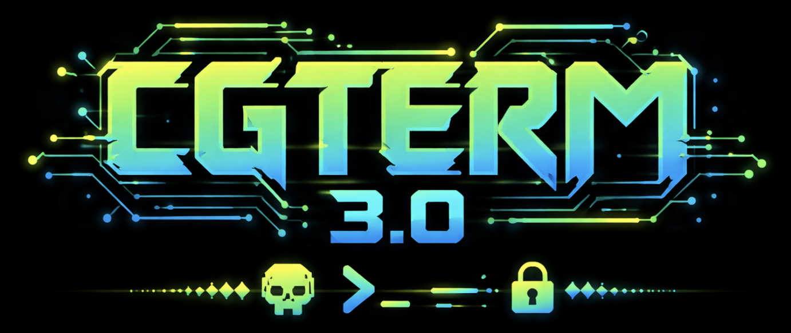

# CGTerm 3.0 :: Scene Edition

Modern port of MagerValp's legendary C64 BBS terminal, released by [Genesis Project](https://csdb.dk/group/?id=8) in 2026. Same soul, modern systems.



[](https://github.com/unbreached/CGTerm-3.0/releases/latest)
[](LICENSE)
[](#install)

## About

CGTerm is the C64 BBS terminal originally written by [Per Olofsson (MagerValp)](https://csdb.dk/scener/?id=1497) in 2003. For two decades it has been the go-to client for connecting to elite Commodore 64 BBSes.

CGTerm 3.0 is a major overhaul: the codebase is cleaned, the foundation is lifted to modern SDL, and the client is extended with the features sysops, swappers and elites have been asking for. PETSCII on glass. Files in motion. Real boards.

## Features

**File transfers**
- Punter and Multi Punter batch (C*Base), verified block by block
- ZMODEM batch send and receive with file names, sizes and crash recovery, auto-started when a board begins sending
- XMODEM, XMODEM-CRC, XMODEM-1K with automatic CRC to checksum fallback
- Rainbow protocol
- Last protocol and direction remembered: T then Return repeats the previous transfer
- Transfer progress with live hex feed; cancel asks for confirmation without stalling the other side
- Every transfer logged with bytes, time and cps, and summarised on screen

**Disk images**
- Read and write D64 / D71 / D81 directly, including images with error tables and 1581 directories
- CBM-style directory listing with blocks, type, splat and lock markers and the disk header line
- Validate (rebuild the BAM), lock and unlock, rename disk and ID, extract files to the host, insert host files into an image
- PETSCII-correct filename conversion (`.prg` <-> `,p`, `.seq` <-> `,s`, `.usr` <-> `,u`)

**Terminal**
- PETSCII and ANSI (80 col) with runtime toggle
- ANSI emulation for Mystic, Synchronet and Enigma boards: scroll regions, iCE colours, 256 and truecolour SGR, line drawing, DECSC/DECRC, insert and delete, xterm function keys
- Telnet negotiation (terminal type, window size, suppress go-ahead), raw-TCP boards handled transparently
- Status line with board, mode, capture and macro state
- Session capture to file, toggled at any time
- Copy screen text to the clipboard; paste paced to baud with UTF-8 transliteration
- Macro record and playback including RETURN, cursor and function keys
- Per-bookmark auto-login scripts (`login=w:Handle;s:name;cr;...`)

**Networking and UX**
- IPv4 and IPv6 with multi-address fallback, non-blocking connect, ESC to cancel
- Auto-reconnect after a dropped carrier with a countdown in the status line
- Connection history with one-key redial
- 40 bookmark slots with notes, ANSI/PETSCII flag per board
- Options panel: sound, music volume, baud emulation, zoom, status line, capture, transfer log
- Keyboard layouts picked from any `.kbd` file in the assets folder

**Scene polish**
- Demo-style splash: vectorballs, plasma, fire, rotozoom, wireframe morph
- Sine wave scroller with scene greetz
- XM/MOD tracker music via libopenmpt, sound effects mixed in
- Modem theatre: fake AT dial sequence and V.34-ish carrier audio, ESC skips straight to CONNECT
- CRT power-off effect on quit
- 15 header and menu fonts, custom font converter (`tools/make_font.py`)

## Platforms

| Platform | Status |
|----------|--------|
| macOS (arm64 + x86_64) | Native .app bundle |
| Linux | `make install`, .deb-friendly paths |
| Windows | Portable zip (unzip and run), native MinGW/MSYS2 build |

Cross-compilation from macOS to Windows via MinGW.

## Install

Grab the latest build from [Releases](https://github.com/unbreached/CGTerm-3.0/releases/latest).

### macOS

Open the `.app` bundle. First launch may require right-click → Open, or on macOS 15 System Settings → Privacy & Security → Open Anyway (the build is signed but not notarized).

### Linux

```bash
sudo apt install libsdl1.2-dev libopenmpt-dev
make && sudo make install
```

### Windows

Unzip the portable archive and run `cgterm.exe`. Settings, bookmarks, notes and logs live under `%APPDATA%\CGTerm`.

## Build from source

Requirements: SDL 1.2 (sdl12-compat is fine), libopenmpt, GCC or Clang, GNU make.

```bash
git clone https://github.com/unbreached/CGTerm-3.0.git
cd CGTerm-3.0
make
make test     # protocol, ANSI and disk-image regression tests (no window, no network)
make fuzz     # mutation fuzzing of the disk-image parser with the sanitizers on
```

Full guide in [INSTALL](INSTALL). Changelog in [CHANGELOG.md](CHANGELOG.md). Rainbow protocol notes in [docs/RAINBOW.txt](docs/RAINBOW.txt). In-app help with every key: press `?`.

## Files

| Linux and macOS | Windows | What |
|-----------------|---------|------|
| `~/.cgtermrc` | `%APPDATA%\CGTerm\cgterm.cfg` | settings |
| `~/.cgterm-bookmarks` | `%APPDATA%\CGTerm\cgterm-bookmarks.cfg` | bookmarks |
| `~/.cgterm-notes` | `%APPDATA%\CGTerm\cgterm-notes.cfg` | notes and login scripts |
| `~/.cgterm-history` | `%APPDATA%\CGTerm\cgterm-history.log` | connection history |
| `~/.cgterm-transfers.log` | `%APPDATA%\CGTerm\cgterm-transfers.log` | transfer log |

A system-wide `/etc/cgterm.cfg` (or `cgterm.cfg` next to the executable) is read first and the per-user file on top.

## Website

[www.cgterm.se](http://www.cgterm.se) has the downloads, news and the board list.

## Boards to try

```
Frozen Floppy BBS   telnet://bbs.retrohack.se:64128
```

## Credits

```
scene code........ m00p
music............. Mr.Death
support........... mermaid
ideas............. Larry
tested by......... hedning, Jucke, SkyHawk, Larry
original code..... MagerValp
```

Website: [www.cgterm.se](http://www.cgterm.se)

Full greetz list in the classic [README](README).

## License

BSD 2-Clause. Same license as the original CGTerm by Per Olofsson. See [LICENSE](LICENSE).

```
Copyright (c) 2003, Per Olofsson.        (original CGTerm)
Copyright (c) 2026, The Genesis Project. (CGTerm 3.0 Scene Edition changes)
```
